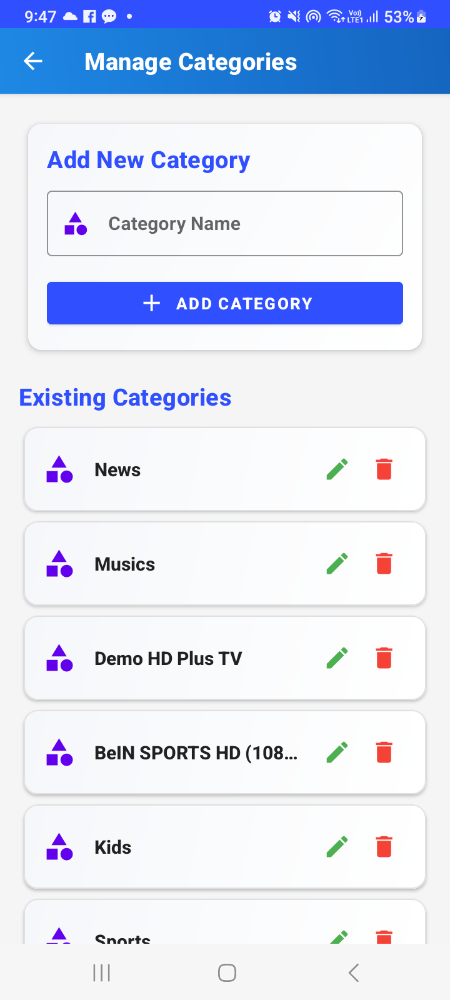

# URL TV Admin

URL TV Admin is a powerful Android application designed for managing IPTV content. It provides an intuitive interface for administrators to manage channels, categories, and monitor network connectivity.

## Features

### 1. Dashboard
- Clean and modern Material Design interface
- Quick access to all administrative functions
- Real-time network status monitoring
- Animated UI elements for better user experience

### 2. Channel Management
- Add, edit, and delete channels
- Organize channels by categories
- Support for channel logos
- URL validation for stream links

### 3. Category Management
- Create and manage channel categories
- Edit category details
- Delete unused categories
- Hierarchical category organization

### 4. Network Monitoring
- Real-time network status checking
- Visual indicators for connection quality
- Support for WiFi and cellular connections
- Automatic status updates

## Technical Features

- **Modern Architecture**
  - Written in Kotlin
  - Uses ViewBinding for view access
  - Firebase Realtime Database integration
  - Repository pattern implementation

- **UI/UX**
  - Material Design 3 components
  - Smooth animations and transitions
  - Responsive layout design
  - Dark theme support

- **Network Handling**
  - Real-time network quality monitoring
  - Automatic reconnection handling
  - Support for various network types
  - Bandwidth quality indicators

- **Data Management**
  - Firebase integration
  - Local caching
  - Real-time updates
  - Data validation

## Requirements

- Android 6.0 (API level 24) or higher
- Internet connection
- Firebase project configuration

## Installation

1. Clone the repository
2. Add your `google-services.json` file to the app directory
3. Build and run the project using Android Studio

## Contributing

Contributions are welcome! Please feel free to submit a Pull Request.

## License

This project is licensed under the MIT License - see the LICENSE file for details.

## Support

For support, email support@urltvadmin.com or create an issue in the repository.

## Acknowledgments

- Material Design Components
- Firebase
- Glide for image loading
- Android Jetpack libraries

---

For any questions or updates, reach out to [Samyak Kamble](mailto:arrowwouldpro@gmail.com)  .  
